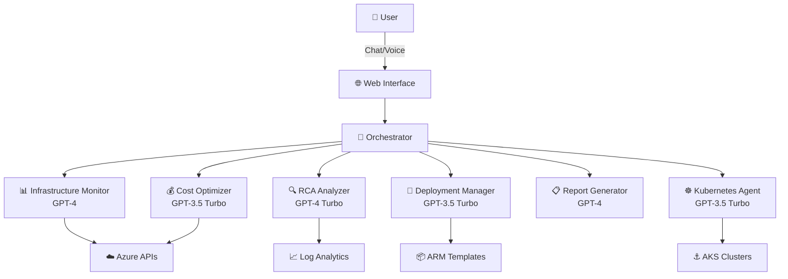

# 🚀 DevOps Sentinel Multi-Agent System

<p align="center">
  
  
  
  
  
</p>

<p align="center">
  <strong>An intelligent multi-agent system for Azure DevOps operations powered by AI</strong>
</p>

---

## 🌟 Overview

DevOps Sentinel is a cutting-edge multi-agent system that revolutionizes Azure infrastructure management through AI-powered automation. Each specialized agent uses different AI models optimized for their specific tasks, providing intelligent insights, automated analysis, and real-time monitoring of your Azure environment.

### ✨ Key Features

- **🤖 6 Specialized AI Agents** - Each with its own GPT model and expertise
- **☁️ Real Azure Integration** - Live data from your Azure subscription
- **💬 Beautiful Chat Interface** - Modern web UI with real-time updates
- **🎯 Intelligent Analysis** - AI-powered insights and recommendations
- **📊 Comprehensive Reporting** - Automated report generation with visualizations
- **🔄 Agent Collaboration** - Agents work together to solve complex problems

## 🏗️ Architecture



## 🛠️ Installation

### Prerequisites

- Python 3.10+
- Azure Subscription
- Azure OpenAI Service
- Node.js (optional, for Azure MCP)

### Quick Start

1. **Clone the repository**
   ```bash
   git clone https://github.com/yourusername/devops-sentinel-multi-agent.git
   cd devops-sentinel-multi-agent
   ```

2. **Create virtual environment**
   ```bash
   python -m venv devops_env
   # Windows
   .\devops_env\Scripts\activate
   # Linux/Mac
   source devops_env/bin/activate
   ```

3. **Install dependencies**
   ```bash
   pip install -r requirements.txt
   ```

4. **Configure Azure credentials**
   ```bash
   cp .env.example .env
   # Edit .env with your Azure credentials
   ```

5. **Run the system**
   ```bash
   python run.py
   ```

6. **Open the web interface**
   ```
   http://localhost:8080
   ```

## 🔧 Configuration

### Environment Variables (.env)

```env
# Azure Authentication
AZURE_SUBSCRIPTION_ID=your-subscription-id
AZURE_CLIENT_ID=your-client-id
AZURE_CLIENT_SECRET=your-client-secret
AZURE_TENANT_ID=your-tenant-id

# Azure OpenAI
AZURE_OPENAI_ENDPOINT=https://your-resource.openai.azure.com/
AZURE_OPENAI_API_KEY=your-api-key

# Optional: Kubernetes
KUBECONFIG=~/.kube/config
```

### Agent Configuration (config/models.yaml)

Each agent can use a different AI model:

```yaml
agents:
  infrastructure_monitor:
    deployment_name: "gpt-4"
    temperature: 0.3
  cost_optimizer:
    deployment_name: "gpt-35-turbo"
    temperature: 0.2
```

## 💡 Usage Examples

### Chat Interface Commands

```
👤: "Show infrastructure health"
🤖: Analyzing 42 resources across 5 resource groups...
    ✅ 38 Healthy Resources
    ⚠️ 2 Warning Resources
    ❌ 2 Critical Issues Found

👤: "Analyze current costs"
🤖: Total Monthly Cost: $8,234.56 (+4.3% from last month)
    Top Services: Virtual Machines (50.1%), Storage (15.0%)
    💡 Potential Savings: $2,470.37/month

👤: "Why is the API slow?"
🤖: Root Cause Analysis:
    - High CPU usage on api-prod-01 (92.3%)
    - Database connection pool exhausted
    - Recommended Actions: Scale up VM, Optimize queries

👤: "Generate executive report"
🤖: Creating comprehensive report...
    📊 Infrastructure Health: 95%
    💰 Cost Trend: Optimizing
    🚀 Deployments: 12 successful this week
    📈 Full report generated with AI insights
```

## 🤝 Agents

### 📊 Infrastructure Monitor
- **Model**: GPT-4
- **Capabilities**: Real-time monitoring, health checks, performance metrics
- **Data Sources**: Azure Monitor, Resource Manager, Metrics API

### 💰 Cost Optimizer
- **Model**: GPT-3.5 Turbo
- **Capabilities**: Cost analysis, rightsizing, unused resource detection
- **Data Sources**: Azure Cost Management, Billing API

### 🔍 RCA Analyzer
- **Model**: GPT-4 Turbo
- **Capabilities**: Incident analysis, pattern detection, remediation planning
- **Data Sources**: Log Analytics, Activity Logs, Metrics

### 🚀 Deployment Manager
- **Model**: GPT-3.5 Turbo
- **Capabilities**: ARM deployments, rollbacks, validation
- **Data Sources**: Resource Manager, Deployment History

### 📋 Report Generator
- **Model**: GPT-4
- **Capabilities**: Executive summaries, custom reports, trend analysis
- **Data Sources**: All other agents, historical data

### ☸️ Kubernetes Agent
- **Model**: GPT-3.5 Turbo
- **Capabilities**: AKS management, pod monitoring, scaling
- **Data Sources**: AKS API, Kubernetes metrics

## 🚀 Advanced Features

### Agent-to-Agent Communication
Agents collaborate using the A2A protocol:
```python
# Infrastructure Monitor detects issue → RCA Analyzer investigates → Report Generator summarizes
```

### Real-time Updates
WebSocket integration for live updates:
- Instant alert notifications
- Live metric streaming
- Real-time cost tracking

### AI-Powered Insights
Each agent provides intelligent analysis:
- Predictive cost forecasting
- Anomaly detection
- Optimization recommendations
- Natural language explanations

## 🛡️ Security

- **Authentication**: Azure AD Service Principal
- **Encryption**: TLS for all communications
- **RBAC**: Respects Azure role assignments
- **Audit**: Comprehensive logging of all actions

## 📊 Monitoring

The system includes built-in monitoring:
- Agent health status
- Performance metrics
- API call tracking
- Error reporting

## 🔍 Troubleshooting

### Common Issues

1. **Module Import Errors**
   ```bash
   pip install -r requirements.txt --force-reinstall
   ```

2. **Azure Authentication**
   ```bash
   az login
   az account set --subscription "Your Subscription"
   ```

3. **Port Already in Use**
   ```bash
   # Change port in .env
   PORT=8081
   ```

## 🤝 Contributing

We welcome contributions! Please see our [Contributing Guidelines](CONTRIBUTING.md).

1. Fork the repository
2. Create your feature branch (`git checkout -b feature/AmazingFeature`)
3. Commit your changes (`git commit -m 'Add some AmazingFeature'`)
4. Push to the branch (`git push origin feature/AmazingFeature`)
5. Open a Pull Request

## 📚 Documentation

- [Architecture Overview](docs/architecture.md)
- [API Reference](docs/api.md)
- [Agent Development Guide](docs/agents.md)
- [Deployment Guide](docs/deployment.md)

## 🏆 Acknowledgments

- **Azure SDK** - For comprehensive Azure integration
- **Semantic Kernel** - For AI orchestration
- **Quart** - For async web framework
- **Azure OpenAI** - For powering agent intelligence

## 📄 License

This project is licensed under the MIT License - see the [LICENSE](LICENSE) file for details.

## 🌟 Star History

If you find this project useful, please consider giving it a star ⭐

---

<p align="center">
  <strong>Built with ❤️ 
</p>

<p align="center">
  <sub>Powered by Azure OpenAI and Semantic Kernel</sub>
</p>

---

## 🎯 Roadmap

- [ ] Voice interface integration
- [ ] Mobile app support
- [ ] Additional cloud providers (AWS, GCP)
- [ ] Custom agent builder
- [ ] Automated remediation actions
- [ ] Integration with Azure DevOps Pipelines
- [ ] Slack/Teams notifications
- [ ] Grafana dashboard integration

## 💬 Support

- **Issues**: [GitHub Issues](https://github.com/yourusername/devops-sentinel/issues)
- **Discussions**: [GitHub Discussions](https://github.com/yourusername/devops-sentinel/discussions)
- **Email**: devops-sentinel@appsby.io

---

**Thank you for using DevOps Sentinel! Together, we're making DevOps smarter. 🚀**
